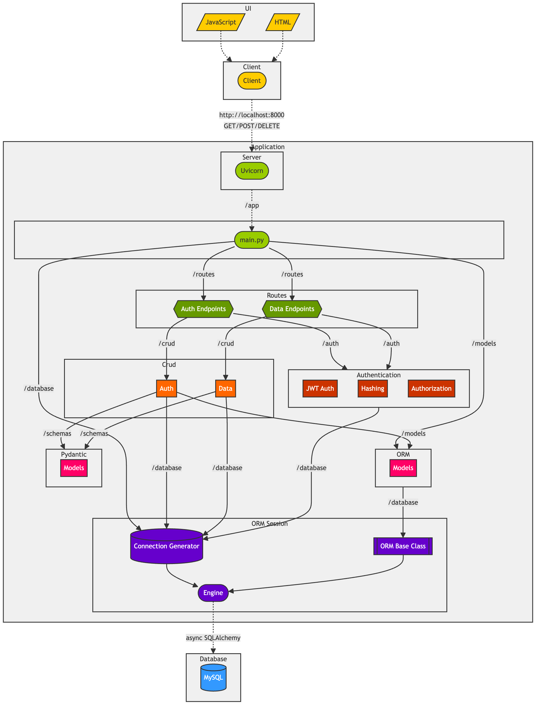

# Database API

This repository contains a dynamic API built with FastAPI that simplifies interactions with MySQL database. The API provides endpoints for connecting to the database, creating, loading, fetching, and deleting tables, and performing CRUD operations on the data.

## Project Outline

- Develop a dynamic FastAPI to simplify MySQL database interactions
- Implement secure authentication and role-based access control using OAuth2 and JWT
- Follow best practices for project structure and logging
- Optimize database operations with asynchronous programming using SQLAlchemy and asyncio
- Provide comprehensive API documentation and usage examples

## Project Architecture

The project consists of the following components:

- **FastAPI**: A Python web framework for building APIs. It serves as the main entry point for the API and handles incoming requests and outgoing responses.

- **OAuth2 Authentication** : The API utilises OAuth2 with JWT (JSON Web Tokens) for secure authentication and authorisation. It implements role-based access control to differentiate between admin and non-admin users.

- **MySQL Database**: The API interacts with a MySQL database for storing and retrieving data. It provides endpoints for creating databases, tables, and performing CRUD operations on the data.

- **SQLAlchemy**: A SQL toolkit and Object-Relational Mapping (ORM) library for Python. It is used to define the database models, establish connections, and perform database operations asynchronously.

- **Pydantic**: A Python library for data validation and settings management using Python type annotations. It is used to define and validate request and response models, ensuring data integrity and consistency.



## API Components

### Endpoints

#### Authentication

To access protected endpoints, you need to obtain an access token by providing valid credentials.

- **`POST /register-api-user`**: Register a new API user (admin only).
- **`POST /get-token`**: Obtain an access token by providing API user credentials.

#### Database Management

- **`POST /create-database`**: Create a new database (admin only).
- **`POST /create-db-user`**: Create a new database user (admin only).

#### Data Management

- **`POST /create-table`**: Create a new table in a database (admin only).
- **`GET /get-table/{db_name}/{table_name}`**: Get data from a table.
- **`DELETE /delete-table/{db_name}/{table_name}`**: Delete a table from a database (admin only).
- **`POST /insert-data`**: Insert data into a table (admin only).

### Logic Flow

The API follows a structured logic flow to handle incoming requests and perform the necessary operations. It includes authentication, permission checks, database operations, and response generation. The logic is separated into two main components: Dependency and Main.

**Dependency Logic** (for all endpoints):

- Validate the access token and extract the user's username.
- Verify the user's existence and permissions.

**Main Logic** (for `register_api_user` endpoint):

- Confirm the user does not already exist.
- Hash the user's password and create a new API user.

The diagram below illustrates dependency logic flow for all API endpoints and main logic flow for `register_api_user` and `get-token` endpoints:


For detailed information about request and response formats, refer to the API documentation once locally deployed at [http://localhost:8000/docs](http://localhost:8000/docs/).

## Requirements

- Python (version 3.12)
- MySQL (version 8.3.0)

## Setup Instructions

Clone the repository:

```bash
git clone https://github.com/hawa1222/database-api.git
cd database-api
```

Set up Python environment:

``` bash
python3 -m venv .venv
source .venv/bin/activate
pip install -r requirements.txt
```

Generate SSL certificate and key files (`cert.pem` and `key.pem`) and place them in the project root directory (optional).

Configure environment variables:

- Copy .env_template to .env
- Fill in all required variables in .env

## Usage

To start the Database API server, run the following command:

```bash
poetry run uvicorn app.main:app --reload
```

The API will be accessible at [http://localhost:8000](http://localhost:8000).

## License

This project is licensed under the MIT License - see the [LICENSE](LICENSE.txt) file for details.
