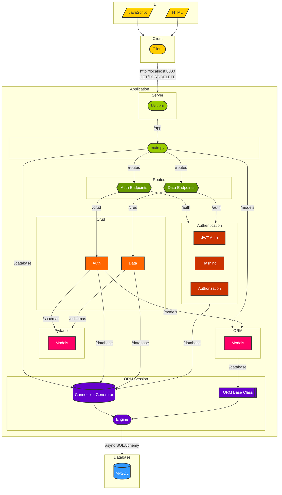

```mermaid
flowchart TD
    %% Global styles for better visibility on light and dark backgrounds
    classDef default fill:#f0f0f0,stroke:#333,stroke-width:2px,color:#333
    classDef highlight fill:#ffcc00,stroke:#333,stroke-width:2px,color:#333
    classDef server fill:#99cc00,stroke:#333,stroke-width:2px,color:#333
    classDef routes fill:#669900,stroke:#333,stroke-width:2px,color:#fff
    classDef crud fill:#ff6600,stroke:#333,stroke-width:2px,color:#fff
    classDef auth fill:#cc3300,stroke:#333,stroke-width:2px,color:#fff
    classDef models fill:#ff0066,stroke:#333,stroke-width:2px,color:#fff
    classDef orm fill:#6600cc,stroke:#333,stroke-width:2px,color:#fff
    classDef database fill:#3399ff,stroke:#333,stroke-width:2px,color:#fff

    subgraph UI
        A0[/JavaScript/]
        A00[/HTML/]
    end

    subgraph Client
        A000([Client])
    end

    subgraph Application
        subgraph Server
            B([Uvicorn])
        end

        subgraph " "
            C([main.py])
        end

        subgraph "Routes"
            D1{{Auth Endpoints}}
            D2{{Data Endpoints}}
        end

        subgraph "Crud"
            E1[Auth]
            E2[Data]
        end

        subgraph Authentication
            F1[JWT Auth]
            F2[Hashing]
            F3[Authorization]
        end

        subgraph Pydantic
            G1[Models]
        end

        subgraph ORM
            H1[Models]
        end

        subgraph "ORM Session"
            I1([Engine])
            I2[[ORM Base Class]]
            I3[(Connection Generator)]
        end
    end

    subgraph Database
        G[(MySQL)]
    end

    %% Connections
    A0 & A00 -.-> Client
    Client -.->|http://localhost:8000<br>GET/POST/DELETE| Server
    Server -.-> |/app| C
    C --> |/models| ORM
    C --> |/routes| D1
    C --> |/routes| D2
    C --> |/database| I3
    E1 & E2 --> |/schemas| Pydantic
    E1 --> |/models| ORM
    D1 & D2 --> |/auth| Authentication
    Authentication --> |/database| I3
    D1 --> |/crud| E1
    D2 --> |/crud| E2
    E1 --> |/database| I3
    E2 --> |/database| I3
    ORM --> |/database| I2
    I3 --> I1
    I2 --> I1
    I1 -.->|async SQLAlchemy| Database

    %% Apply classes
    class A0,A00,A000 highlight;
    class B,C server;
    class D1,D2 routes;
    class E1,E2 crud;
    class F1,F2,F3 auth;
    class G1,H1 models;
    class I1,I2,I3 orm;
    class G database;
```
