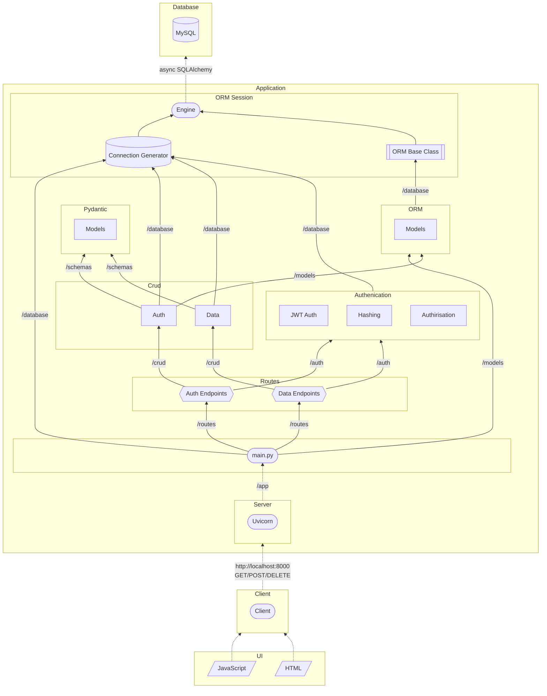

```mermaid
flowchart BT

    subgraph UI
        A0[/JavaScript/]
        A00[/HTML/]
    end

    subgraph Client
        A000([Client])
    end

    subgraph Application
        
        subgraph Server
            B([Uvicorn])
        end

        subgraph " "
            C([main.py])
        end

        subgraph "Routes"
            D1{{Auth Endpoints}}
            D2{{Data Endpoints}}
        end

        subgraph "Crud"
            E1[Auth]
            E2[Data]
        end

        subgraph Authenication
            F1[JWT Auth]
            F2[Hashing]
            F3[Authirisation]
        end

        subgraph Pydantic
            G1[Models]
        end

        subgraph ORM
            H1[Models]
        end

        subgraph "ORM Session"
            I1([Engine])
            I2[[ORM Base Class]]
            I3[(Connection Generator)]
        end

    end

    subgraph Database
        G[(MySQL)]
    end

    A0 & A00 -.-> Client
    Client -.->|http://localhost:8000<br>GET/POST/DELETE| Server

    Server -.-> |/app| C

    C --> |/models| ORM
    C --> |/routes| D1
    C --> |/routes| D2
    C --> |/database| I3

    E1 & E2 --> |/schemas| Pydantic
    E1 --> |/models| ORM
    D1 & D2 --> |/auth| Authenication
    Authenication --> |/database| I3
    D1 --> |/crud| E1
    D2 --> |/crud| E2
    E1 --> |/database| I3
    E2 --> |/database| I3

    ORM --> |/database| I2

    I3 --> I1
    I2 --> I1

    I1 -.->|async SQLAlchemy| Database

```