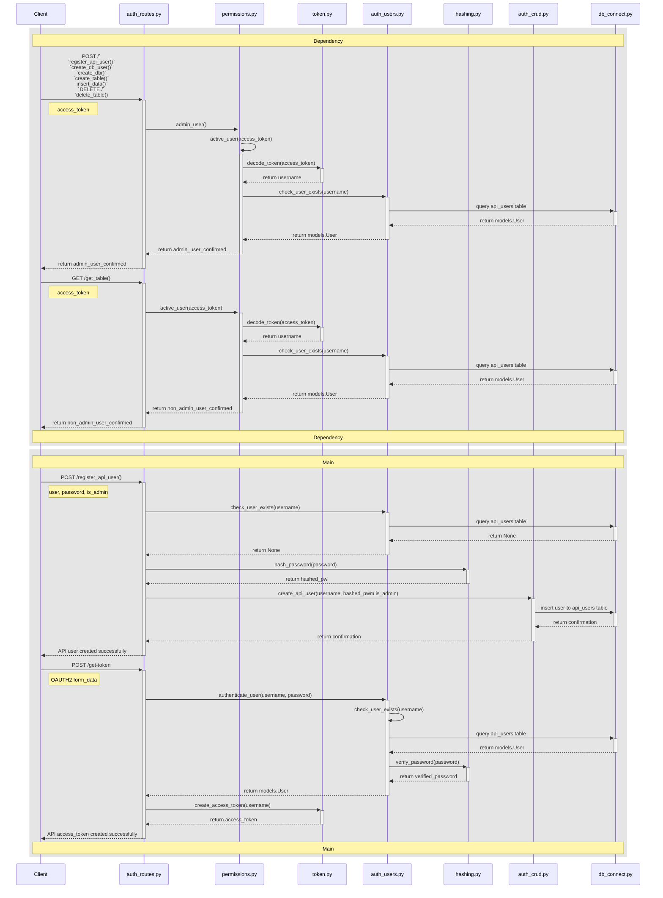

```mermaid
sequenceDiagram
    autonumber off
    
    participant Client
    participant Router as auth_routes.py
    participant Permissions as permissions.py
    participant Token as token.py
    participant AuthUsers as auth_users.py
    participant Hashing as hashing.py
    participant CRUD as auth_crud.py
    participant DB as db_connect.py

    rect rgba(0, 0, 0, 0.1)
    Note over Client,DB: Dependency

    Client->>+Router: POST /`<br/>`register_api_user()`<br/>`create_db_user()`<br/>`create_db()`<br/>`create_table()`<br/>`insert_data()`<br/>`DELETE /`<br/>`delete_table()
    Note right of Client: access_token
    Router->>+Permissions: admin_user()
    Permissions->>+Permissions: active_user(access_token)
    Permissions->>+Token: decode_token(access_token)
    Token-->>-Permissions: return username
    Permissions->>+AuthUsers: check_user_exists(username)
    AuthUsers->>+DB: query api_users table
    DB-->>-AuthUsers: return models.User
    AuthUsers-->>-Permissions: return models.User
    Permissions-->>-Router: return admin_user_confirmed
    Router-->>-Client: return admin_user_confirmed
    
    Client->>+Router: GET /get_table()
    Note right of Client: access_token
    Router->>+Permissions: active_user(access_token)
    Permissions->>+Token: decode_token(access_token)
    Token-->>-Permissions: return username
    Permissions->>+AuthUsers: check_user_exists(username)
    AuthUsers->>+DB: query api_users table
    DB-->>-AuthUsers: return models.User
    AuthUsers-->>-Permissions: return models.User
    Permissions-->>-Router: return non_admin_user_confirmed
    Router-->>-Client: return non_admin_user_confirmed

    Note over Client,DB: Dependency
    end

    rect rgba(0, 0, 0, 0.1)
    Note over Client,DB: Main

    Client->>+Router: POST /register_api_user()
    Note right of Client: user, password, is_admin
    Router->>+AuthUsers: check_user_exists(username)
    AuthUsers->>+DB: query api_users table
    DB-->>-AuthUsers: return None
    AuthUsers-->>-Router: return None
    Router->>+Hashing: hash_password(password)
    Hashing-->>-Router: return hashed_pw
    Router->>+CRUD: create_api_user(username, hashed_pwm is_admin)
    CRUD->>+DB: insert user to api_users table
    DB-->>-CRUD: return confirmation
    CRUD-->>-Router: return confirmation
    Router-->>-Client: API user created successfully
    
    Client->>+Router: POST /get-token
    Note right of Client: OAUTH2 form_data
    Router->>+AuthUsers: authenticate_user(username, password)
    AuthUsers->>AuthUsers: check_user_exists(username)
    AuthUsers->>+DB: query api_users table
    DB-->>-AuthUsers: return models.User
    AuthUsers->>+Hashing: verify_password(password)
    Hashing-->>-AuthUsers: return verified_password
    AuthUsers-->>-Router: return models.User
    Router->>+Token: create_access_token(username)
    Token-->>-Router: return access_token
    Router-->>-Client: API access_token created successfully
    
    Note over Client,DB: Main
    end

```
